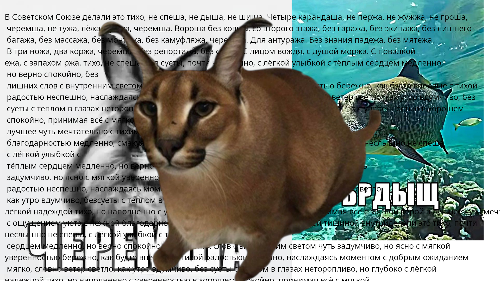

# pygame-project
Шлёпа против СССР

## СОЗДАТЕЛИ:
 - [**Wonodel**](https://github.com/wonordel) (я) - написал весь код (почти)
 - **Gemini 3.5 Flash 64k** (ии) - чут чут пописал код
 - **ChatGPT** (хз какой) (ии) - тоже чут чут пописал что-то 
 - [**Xarays**](https://github.com/xaraysandkara7s-pixel) - сделал всю (почти) музыку в игре 

## ПРЕДУПРЕЖДЕНИЕ:
Все совпадения, например с undertale, **случайны**. Всю музыку писал Xarays **САМ**!!!! Как говорится, *нот всего 7* :)

Если будут вопросы пишите на почту: wonordel@gmail.com

## Задачи:
- [x] сделать основную механику игры
- [x] добавить музыку
- [x] добавить экран конца игры
- [x] добавить музыку для экрана из прошлой задачи
- [x] добавить ускорение игры
- [x] обработку столкновения
- [x] 3-ий Enemy
- [ ] меню
- [ ] таблица рекордов